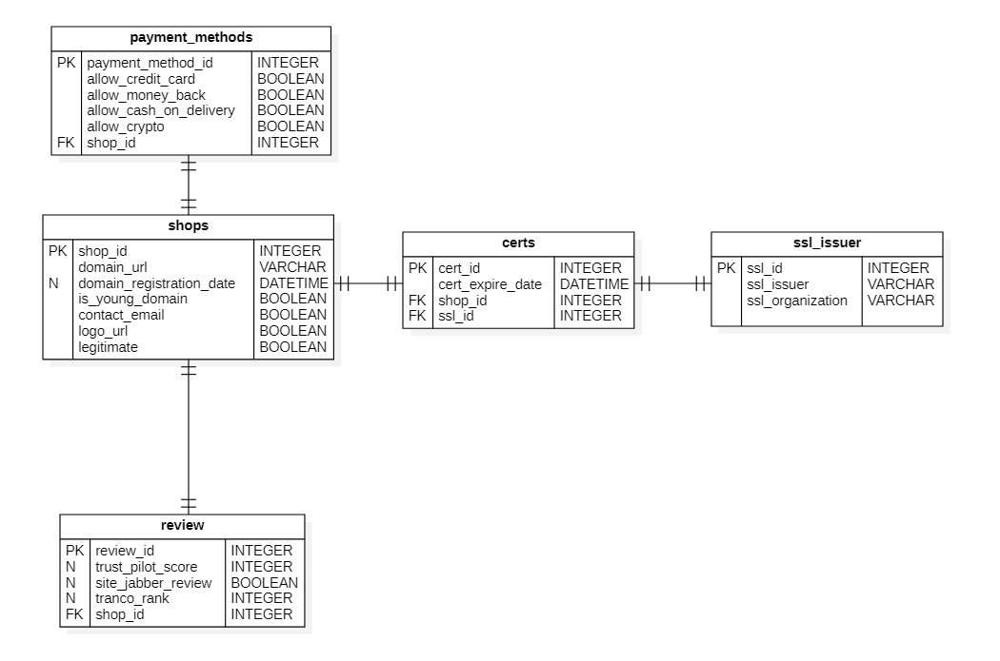

# Fraud Detection Project

## Overview

This project aims to develop a fraudulent online shops detection system using machine learning techniques. The system will analyze website data to identify potential fraudulent websites. This repository shows a practice of training a neural network with AWS tools.

## Project Structure

* **data/**: Contains the dataset used for training and testing.
* **src/dataset_creation**: Contains scripts for creating dataset from original dataset.

## Dataset

The dataset used in this practice is *Fraudulent and Legitimate Online Shops Dataset* published by Audrone Janaviciute and Agnius Liutkevicius [[1]](#dataset_ref). The dataset contains fake (fraudulent) e-shops data together with legitimate e-shops data. The dataset is balanced and contains 1140 records of 579 fake (fraudulent) and 561 real (legitimate) online shops. 

This dataset was loaded into a database with the following structure, in order to show the use of MySQL in RDS.

### Glue ETL.

To avoid extra costs we run the Glue jobs in a Docker container. AWS Glue provides Docker container images that enable developers to build and test their ETL (Extract, Transform, Load) jobs in local development environments. Follow instructions in [[2]](#glue-docker) for more details.

### XBoost SageMaker

The `training/training.ipynb` notebook shows an example of the XBoost training pipeline using SageMaker. As with ETL, we run the glue jobs locally to avoid additional costs.

Before run training code run following commands : 

1. `conda create --prefix=env python=3.10`
2. `conda activate .\env`
3. `conda install -c conda-forge sagemaker`
4. `docker pull <image_uri>`

# References

- <a name="dataset_ref">**[1]**</a> Janaviciute, Audrone; Liutkevicius, Agnius (2023), *"Fraudulent and Legitimate Online Shops Dataset"*, Mendeley Data, V1, doi: 10.17632/m7xtkx7g5m.1
- <a name="glue-docker">**[2]**</a> Sekiyama, Noritaka; Pathak, Vishal; Vajiraya, Subramanya (2022), *"Develop and test AWS Glue version 3.0 and 4.0 jobs locally using a Docker container"*, AWS Big Data Blog, url: https://aws.amazon.com/blogs/big-data/develop-and-test-aws-glue-version-3-0-jobs-locally-using-a-docker-container/
